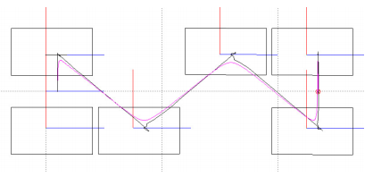
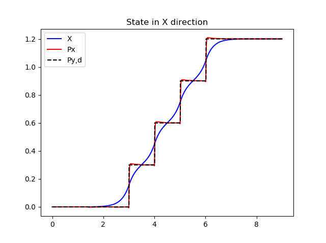
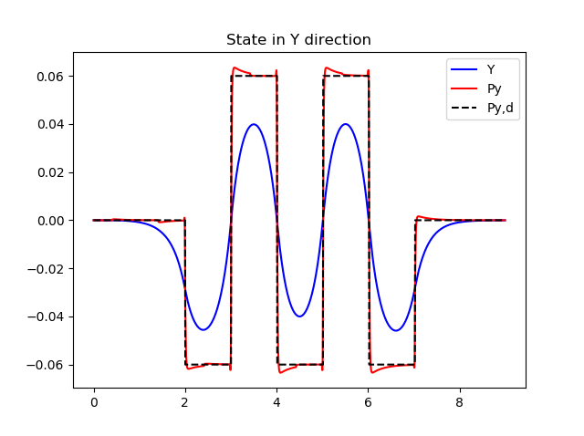
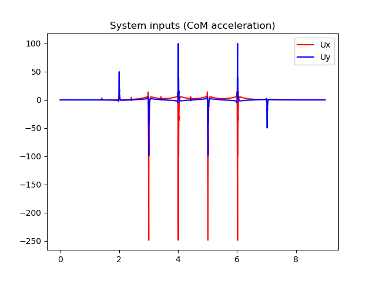
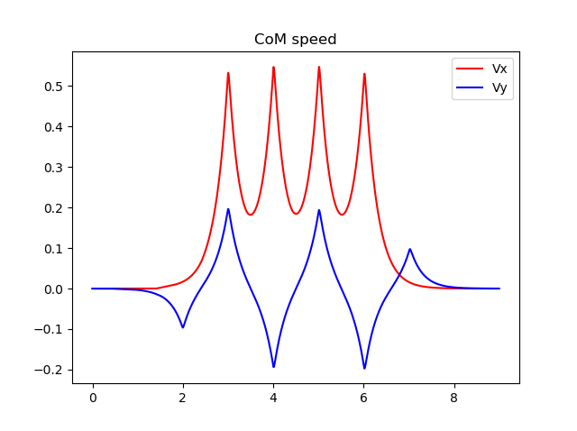

# Walking pattern generation examples using zero moment point method
This repository presents my take on movement path generation for walking robots using zero moment point (ZMP) method.

The basic idea is to generate such a movement path of a robot's center of mass that keeps the zero moment point inside the support polygon (the area below the foot). If the ZMP stays withing the support polygon, the robot does not tip over.

The basic concept I use is the table-cart model (and also inverted pendulum is presented). I won't go into details of the model, please read the reference publications listed below. They are necessary for understanding the concepts anyways.

### References
[1] Biped walking pattern generation allowing auxiliary ZMP control, Shuuji Kajita et al. Proceedings of the 2006 IEEE/RSJ international conference on intelligent robots and systems, october 2006, p. 2993-2999

[2] Biped walking pattern generation by using preview control of zero-moment point, Shuuji Kajita et al., Proceedings of the 2003 IEEE international conference on robotics & automation, september 2003, p. 1620-1626

[3] General ZMP preview control for bipedal walking, Jonghoon Park, Youngil Youm, IEEE international conference on robotics and automation, april 2007, p. 2682-2687

[4] Design of an optimal controller for discrete-time system subject to previewable demand, Tohru Katayama, International Journal of Control, march 1985, vol 41, no. 3, p. 677-699

### Introduction
A walking bipedal robot is a highly dynamic system in that as soon as one leg is lifted from the ground, the robot tends to fall. To overcome this, a motion planner is needed which calculates a movement path that keeps to robot stable.

Zero moment point control is one method for keeping the robot stable. The idea is that as long as the ZMP stays inside the support polygon (area under the foot) during movement, the robot does not fall. To simplify things, the robot is reduced to just its center of mass (CoM), and the movement path of the CoM is planned.

For example, below is a top view of a bipedal robot's movement path [3].

The squares represent the foot locations, starting from the left side and advancing to the right. 3 steps are presented.

This problem can be decoupled to X and Y axis separately. [3] also shows the X and Y axis separately:

![X and Y axis of the movement path[3]](docs/Figure_6.png)

In the top part the X axis is shown, with forward motion in clear steps. The bottom part the Y axis shows the sideways motion. Red dashed line is the ZMP reference and blue line is the actual value. It can be seen that the actual value follows the reference rather nicely. The black line is the movement path of the center of mass, which can be seen moving smoothly and it needs not to be placed over the foot during the movement. This allows for smooth dynamic walking.

### Explanation of the code
All the code is divided into several functions, some of which are modified between files and some stay constants. I'll briefly introducte the functions below.

#### State space system generation
The dynamic state space system is generated in _create_system_ function. The function takes some parameters necessary for the model, typically sampling time (time step), height of the center of mass and gravity.

The state space is a discrete representation of the system, shown in equation below [3].

![Discrete state space system[3]](docs/equ_1.png)

For example, the basic model in [3] with all the vectors written out is 

![Full state space presentation[3]](docs/equ_2.png)

where the problem has one movement direction only (X-axis, i.e. a 2D problem).

All the systems are written out according to the publications listed above. For clarity, everything is written out.

The function returns all the matrices and also initializes the input, output and state vectors to zero.

#### Controller designer
The second function, which was most difficult to implement and took a few weeks to get to work, is _create_controller_ which designs an optimal LQI (Linear-Quadratic-Integral) controller with preview (look-ahead) for the given state space system. The function is a direct implementation of the method described in [4].

I have to admit I don't completely understand the math behind the controller design process, but directly implementing the method seems to work rather well. Also, it took time to get the "augmented state" matrices and vectors correct. There still might be bugs even though with the given systems the designed seems to work.

The function takes the state matrices as input and also needs loss coefficients that are used in the design optimization. The output is gain values for controller of type [4]

![Controller function[4]](docs/equ_3.png)

where the first part is the integral term, integrating the error of the output, second part is the state feedback and the last part is the preview part.

#### Step pattern generation
The third function generates the step pattern and is called _create_step_pattern_. It simply creates an array of reference values for the zero moment point; forward going steps in X direction and sideways motion in Y direction.

The example function generates movement similar to the example in the introduction chapter.

#### Calculating the controller
The controller needs to be calculated for each time step. The function _calculate_controller_ takes the controller gains and state together with the reference array as input and outputs the controller output value.

#### Calculating the new state
New state is calculated at each time step in function _calculate_state_. It takes the current state and state space representation and the controller output value as input, and outputs the new state.

### Files

#### zmp_inverse_pendulum.py
This example starts with the inverse pendulum model described in [1]. I present this first since I only did the basic model and did not enhance it further.

In this file the system as only single direction. To achieve two directions, all calculations are done twice for each direction. Because the equations for both directions are the same, only one set of system and controller is needed, just the state representation is doubled.

#### zmp_cart_table.py
This example is the basic table-cart model described in [2] and [3].

In this file the system as only single direction. To achieve two directions, all calculations are done twice for each direction. Because the equations for both directions are the same, only one set of system and controller is needed, just the state representation is doubled.

#### zmp_cart_table_v2.py
This file also uses the model from [2] and [3]. This extends the previous system by having both X and Y directions in the same state space representation, and as a result it is enough to run all the functions once during the main loop.

#### zmp_cart_table_v3.py
This file further enhances the table cart model by adding the horizontal angular momentum according to [3]. This makes the model more accurate and also allows more control over the motion (one more parameter in the controller designer).

### Example output
An example of the output of the basic table cart model, _zmp_cart_table.py_ is shown in next figures.

### License

Following license applies to all code in this repository.

Copyright &copy; 2019 Lauri Peltonen

This program is free software: you can redistribute it and/or modify
it under the terms of the GNU General Public License as published by
the Free Software Foundation, either version 3 of the License, or
(at your option) any later version.

This program is distributed in the hope that it will be useful,
but WITHOUT ANY WARRANTY; without even the implied warranty of
MERCHANTABILITY or FITNESS FOR A PARTICULAR PURPOSE.  See the
GNU General Public License for more details.

You should have received a copy of the GNU General Public License
along with this program.  If not, see <https://www.gnu.org/licenses/>.
